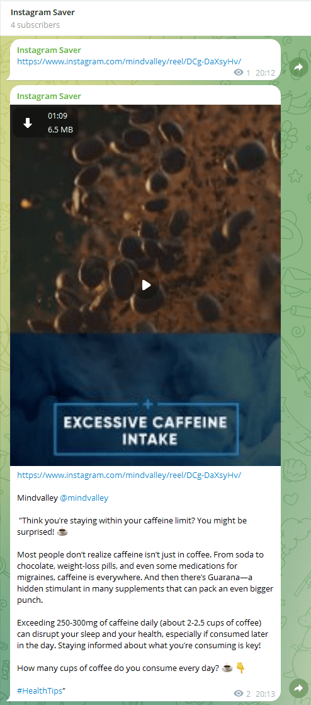
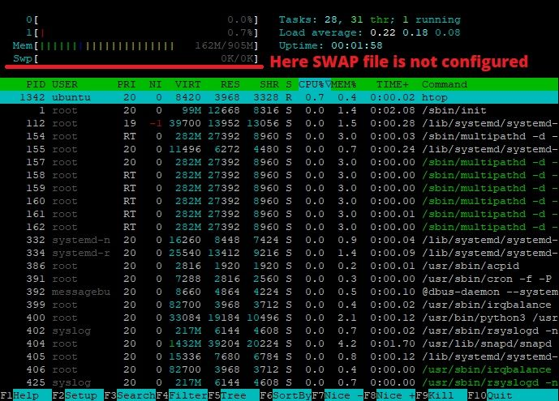

<h1>Script usage example within the Telegram channel:</h1>
<div>
    Once you send the link this script will read the new message and it will trigger the rest of the code which will open the URL in the Chrome browser with the specified profile and then video or image will be sent back to the Telegram channel
</div>
<br/>
<a href='https://next-event-andrey-tuguchev.vercel.app/' target="_blank" >
        
</a><br/><br/><br/>


==================================

# Python script to scrap data from Instagram and send it into Telegram chat

You need to login to your server via SSH or open the terminal if it's on your local machine.
I will use code snippets for Ubuntu/Debian server OS.

**Download package information from all configured sources for your current OS.**\
```
sudo apt-get update
```

**Install ZIP utility**\
```
sudo apt install unzip
```

**Install python package manager**\
```
sudo apt install python3-pip
```

**Using pip install tendo which will help us to make sure that we run our script as a singleton**\
```
pip install tendo
```

\
\
**Install Selenium package to automate web browser interaction**\
```
pip install selenium
```

\
\
**Install Beautifulsoup to scrape information from web pages**\
```
pip install beautifulsoup4
```

\
\
**Install lxml library for processing XML and HTML in the Python language.**\
```
pip install lxml
```
\
\
**Install chromedriver binary file. It's a standalone server which provides capabilities for navigating to web pages, user input, JavaScript execution, and more**\
```
pip install chromedriver-py
```

\
\
**Download latest Google Chrome package:**\
```
wget https://dl.google.com/linux/direct/google-chrome-stable_current_amd64.deb
```
\
\
**Install this debian package**\
```
sudo dpkg -i google-chrome-stable_current_amd64.deb
```
\
\
**dpkg: dependency problems can throw an error during the Chrome installation process in Ubuntu. You can fix it with this:**\
```
sudo apt install -f
```

\
\
**Install Google Chrome again with fixed dependencies**\
```
sudo dpkg -i google-chrome-stable_current_amd64.deb
```

**Google Chrome version check:**\
```
google-chrome --version
```


\
\
**Check current RAM and SWAP file using command:**\
```htop```\
if SWAP is 0 then you need to create it. This will reduce the CPU load for the data when RAM is full because when an instance runs out of RAM linux will try to write data into SWAP but you don't have one and it will constantly try to do it again and again... It will cause a huge CPU overload...

**Example of NOT configured SWAP file in the system:**\


**Create SWAP file which is 2-3 times bigger than your RAM using this command set for Ubuntu Server:**\
```
sudo fallocate -l 4G /swapfile; sudo chmod 600 /swapfile; sudo mkswap /swapfile; sudo swapon /swapfile; free -h; sudo cp /etc/fstab /etc/fstab.bak; echo '/swapfile none swap sw 0 0' | sudo tee -a /etc/fstab; sudo sysctl vm.swappiness=10;
```


\
\
Now you need to create `.env.local` file where you will save all your private keys. Placeholder content for this file can be found here:\

```
telegram_api_key=REPLACE_WITH_YOUR_TELEGRAM_KEY
telegram_chat_id=REPLACE_WITH_YOUR_TELEGRAM_CHAT_ID
user_agent=Mozilla/5.0 (Macintosh; Intel Mac OS X 10_14_6) AppleWebKit/605.1.15 (KHTML, like Gecko) Version/13.0.3 Safari/605.1.15
timezone=America/New_York
```


\
\
the last part of this configuation guide is in progress...
